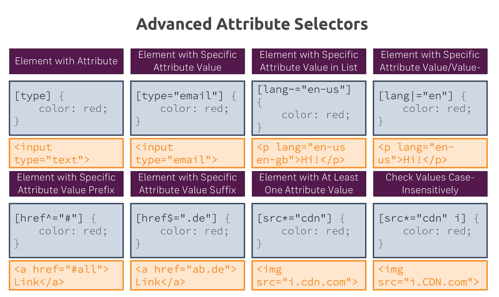
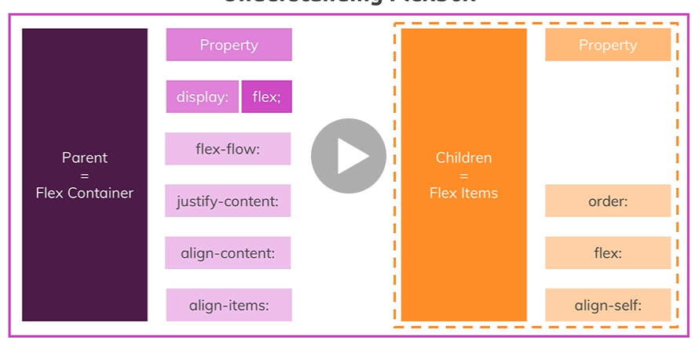
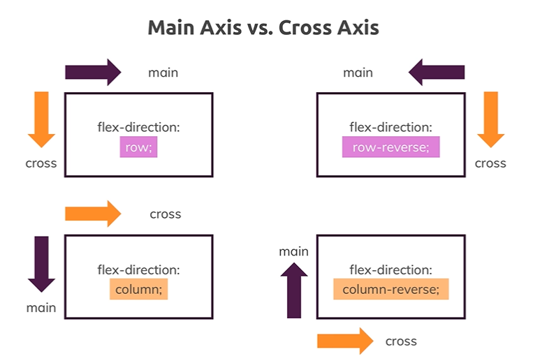
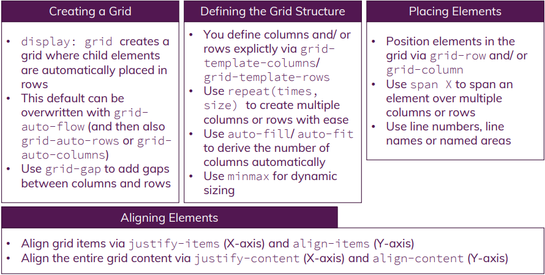
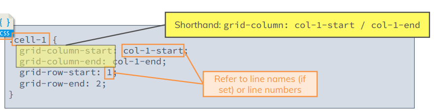

# CSS-practice and my comments for the course:
[udemy] CSS - The Complete Guide 2020 (incl. Flexbox, Grid &amp; Sass)

### Combinators

`+` Second element comes immediately after first element and share the same parent

`~` Second element comes anywhere after first element and share the same parent

`>` Second element is a direct child of first element

` (space)` Second element is a descendant of the first element

### Block-level vs Inline Elements

Block-level elements are rendered as a block and hence take up all the available horizontal space: `
 , <section> , <article> , <nav>, <h1>, 
`

Inline elements on the other hand only take up the space they require to fit their content in. Setting a width  or height, margin-top  and margin-bottom  on an inline element also has no effect

You can set display: inline-block  to merge behaviors:` <a> ,  , `

### Pseudo classes and elements
`:` pseudo-class => special state of an element
`::` pseudo-name => specific part of an element

box-sizing : https://developer.mozilla.org/en-US/docs/Web/CSS/box-sizing
More on height & width: https://www.w3schools.com/css/css_dimension.asp

The display  Property: https://developer.mozilla.org/en-US/docs/Web/CSS/display

### Positioning
Positioning Context (anchor):

`static` is default, remains in document flow.

`fixed` relates to viewport. Convenient for navigation bar. To fix border outside viewport: `box-sizing: border-box`. Excluded from document flow.

`absolute` relates to  another element: `html` or closest with position ancestor applied. Excluded from document flow.

`relative` relates to itself, partly remains in document flow.

`sticky` relates to viewport and another element, combination of `relative` and `fixed`, but is partly supported but browsers.

Flow: `absolute` and `fixed` value take the element the value is applied to out of the document flow.

Z-index default is 0 or auto. To use z-index must apply `position`.

Stacking Context: defines stacking behavior of child elements, created when applying fixed/ sticky or absolute/ relative in combination with `z-index`. When we apply position we change stacking context from viewport to parent's stacking context. So other element with `z-index` 2, can still be on the top, because our parent's position 1, even if our element is 100, but inside parent and have position applied.

The “position” properties: `top`,  `bottom`,  `left`  or `right` can be used only after we add `position` different than `static`. 

Positioning theory: https://developer.mozilla.org/en-US/docs/Learn/CSS/CSS_layout/Positioning

More about the "position" property: https://developer.mozilla.org/en-US/docs/Web/CSS/position

The z-index: https://developer.mozilla.org/en-US/docs/Web/CSS/z-index

### Units
Rules:

1.  `position:fixed` + % = % of `viewport`

2. If `position:absolute` + % = % of the closest `Ancestor` with `padding`.

2. If `position:static` or  `position:relative`  + % = % of the closest  `Ancestor`.
`px`

`%` 

`em` multiply browser default font size (ex 16px), can be overridden by parent elements (H1, body, html)

`rem` root, adjust to font init html element size, better than `em`

`vh` viewport height

`vw` viewport width

`vmin` viewport min (detect what is smaller: height or width)

`vmax` viewport max (detect what is bigger: height or width)

Hiding Vertical Scrollbars on Mac and PC => https://web.archive.org/web/20180505112131/https://blogs.msdn.microsoft.com/kurlak/2013/11/03/hiding-vertical-scrollbars-with-pure-css-in-chrome-ie-6-firefox-opera-and-safari/

Recommended units:

`font-size` of root => `%` or nothing

`font-size` of element => `rem` (`em`=> for children only)

`padding` => `rem`

`border` => `px`

`margin` => `rem`

`width`, `height` => `%`, `vw`, `vh`, `vmin`, `vmax`

`top`, `bottom` => `%`

### Mobile first

Media queries go from smaller to bigger 

@media (min-width: 40rem) and (min-height: 40rem) {}

@media (min-width: 40rem), (orientation: landscape) {}

@media (min-width: 40rem), (orientation: portrait) {}

@media (min-width: 60rem) {}

all @media should be in the end of css

### Styling

`.class input:not([type="checkbox"])` - select all inputs except checkboxes

### Fonts
`font-variant` - change case

`font-stretch`

`letter-spacing` - space between letters

`white-space` - how white space is treated inside the element, `nowrap` - one line, `pre-line`, `pre-wrap`

`line-height` - font size + 2 * space to border = height of element inside, depends on the font family

`text-decoration` - underline, overline, line-through, dotted, wavy, color

`text-shadow` - toRight; toBottom; Blur; Color;

`font` - font shorthand

`font-display` -strategy how to loaf fonts;

`block period` - invisible fallback, space is reserved;

`swap period` - fallback visible immediately;

strategies: `[ auto | block | swap | fallback | optional ]`

### Flexbox

if we apply  `display: flex` - the element becomes parent flex container

`display: inline-flex` makes width fixed to line, cannot change it

`flex-wrap: wrap` width would be reduced, children wrapped to next line

`flex-direction: column/row` children in row or columns, or reverse, changes the main and cross axis

`align-items: stretch` - default 

`align-items: center` - will be centered along cross axis

`align-items: flex-start` - will be on start, along cross axis

`justify-content` - according to the main axis

`align-items: baseline` - aligned not to child or parent border, but to child's content (text) baseline

`align-items` for all items (on parent), but `align-self` for specific item (on child)

Have to set width/height to use these:

`flex-grow: 2` - the element will use remaining space available, over width

`flex-shrink: 0`: not allowed to shrink, cannot become smaller than width. Default is 1.

`flex-basis`:  sets the initial main size, always refer to main axis, 

shortened: `flex: 0 1 auto`

### CSS GRID
use firefox to see layout with grid and names

Container is grid itself, you decide how many rows and columns you need.
Child elements are sit in grid cells

can use `fr` - fracture, which splits remaining size accordingly

this:

can be replaced with shorthand:
`grid-area: row-1-start / 2 / row-2-end / span 3;`

`grid-column-end: span 3` allows to occupy 3 cells, can lead to overlapping

`grid-gap, grid-column-gap, grid-row-gap` to specify gaps between grid cells

 `grid-template-rows: [row-1-start] 5rem [row-1-end row-2-start] minmax(10px, auto) [row-2-end row-3-start] 100px [row-3-end]` you can assign row/line names in parent and reference them in child css

`grid-template-areas` can give name to each cell per row and column, and refer to them in child element. `.` to leave without name.

`grid-template-rows: 3.5rem auto fit-content(8rem)` - will use 8rem if content is smaller, but fit-content if bigger

`justify-items` or `align-items` to position child to grid's rows or columns, default is stretch

`justify-content` or `align-content` to position entire grid to X or Y

`justify-self` or `align-self` to override the above rules for specific element

`grid-auto-flow` where new element should be added: row or column

`auto-fit` and `auto-fill` add as many cells of certain size as you can

`dense` take free space

